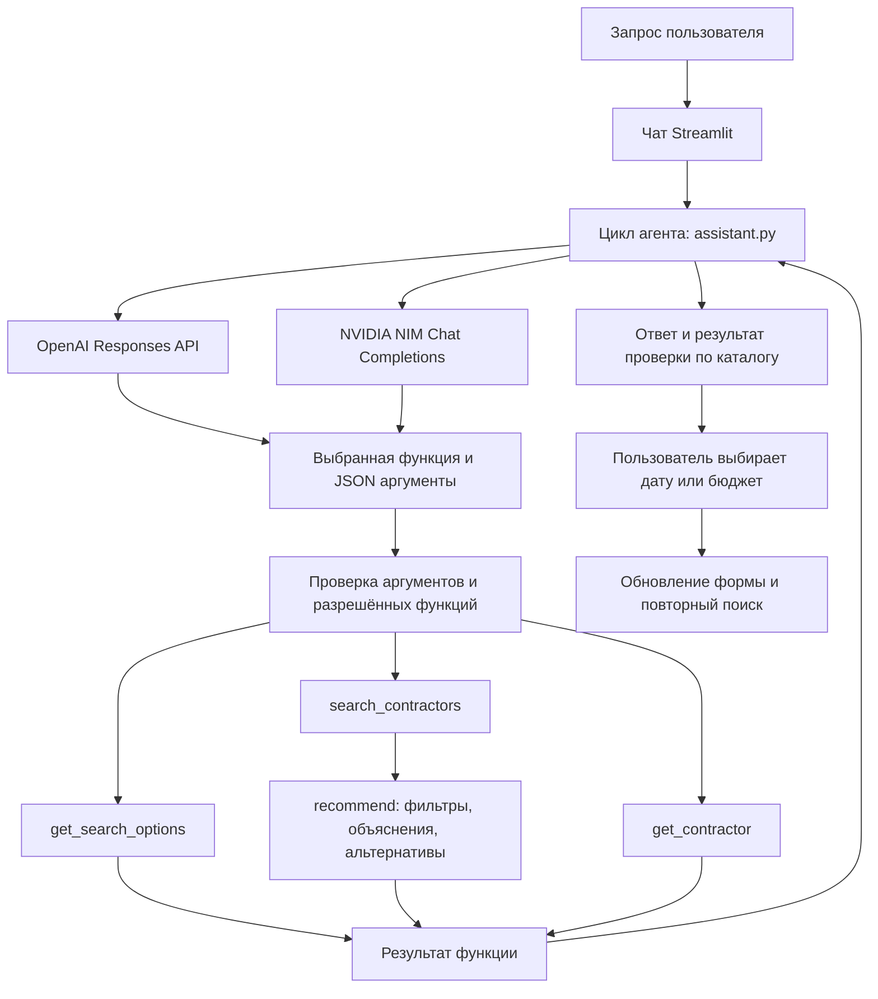

# ИИ-агент подбора подрядчиков

Агент принимает цель на обычном языке, уточняет недостающие условия, сам выбирает
функции и использует их результаты в следующих шагах. В этом проекте его действия
ограничены чтением каталога и поиском: бронирования, оплаты и отправки сообщений нет.

## Схема



На один диалог выбирается один провайдер. OpenAI и NVIDIA — взаимозаменяемые
источники модели, не два обязательных последовательных вызова. Переключение
провайдера или модели открывает отдельную историю. Старый диалог не пересылается
новому провайдеру. Выбор альтернативы кнопкой добавляется в контекст агента.

## Подключение

1. Установите зависимости в виртуальном окружении проекта:

   ```powershell
   python -m pip install -r requirements.txt
   ```

2. Скопируйте `.streamlit/secrets.toml.example` в `.streamlit/secrets.toml`.
   Впишите ключ хотя бы одного провайдера:

   ```toml
   OPENAI_API_KEY = "ваш-ключ-OpenAI"
   OPENAI_MODEL = "gpt-4.1-mini"
   NVIDIA_API_KEY = "ваш-ключ-NVIDIA"
   NVIDIA_MODEL = "meta/llama-3.3-70b-instruct"
   ```

   Можно использовать одноимённые переменные окружения. Файл `secrets.toml`
   имеет приоритет. `.env` автоматически не загружается.

   Ключ OpenAI создаётся в [OpenAI Platform](https://platform.openai.com/api-keys).
   Ключ NVIDIA для размещённого API получите в [NVIDIA API Catalog](https://build.nvidia.com/).
   Доступность моделей и квоты зависят от вашего аккаунта. Модель NVIDIA должна
   поддерживать function calling на выбранном endpoint. Значения выше — начальная
   конфигурация; реальные запросы с вашими ключами нужно проверить отдельно.

3. Запустите приложение:

   ```powershell
   python -m streamlit run app.py
   ```

4. Под формой откройте «ИИ-агент подбора подрядчиков», выберите провайдера и отправьте:

   > Найди ведущего на свадьбу в Алматы 3 октября 2026 года.
   > Бюджет 1 500 000 тенге, русский язык, 6 часов.

   Локальный поиск возвращает пустую выдачу на 03.10 и проверенную альтернативу
   04.10 с двумя вариантами. Агент получает этот результат и объясняет следующий шаг.
   Дата формы меняется только после нажатия «Применить дату 2026-10-04».

Без API-ключа чат отключён, а обычный подбор продолжает работать.
На сервере развёртывания укажите те же поля через хранилище секретов платформы.
Настоящие ключи не добавляйте в GitHub: `.streamlit/secrets.toml` и `.env` исключены из Git.

## Реализация подключений

Один Python SDK `openai` используется для обоих провайдеров, но протоколы разделены:

| Провайдер | Адрес | Вызов | Ответ функции |
| --- | --- | --- | --- |
| OpenAI | `https://api.openai.com/v1` | `client.responses.create(...)` | `function_call_output` с `call_id` |
| NVIDIA | `https://integrate.api.nvidia.com/v1` | `client.chat.completions.create(...)` | сообщение `role="tool"` с `tool_call_id` |

Ключ передаётся только SDK выбранного провайдера. Обёртка не использует глобальный
`OPENAI_BASE_URL`, чтобы не отправить ключ OpenAI на endpoint NVIDIA по ошибке.
Для OpenAI включён `store=False`; это не обещание отсутствия всех журналов
провайдера. Переписка и результаты функций передаются выбранному API.

## Функции агента

| Функция | Что делает |
| --- | --- |
| `get_search_options()` | Возвращает города, категории, форматы, языки и границы календаря. |
| `search_contractors(...)` | Проверяет аргументы, вызывает существующий `recommend()`, возвращает карточки, причины отсева и альтернативы. |
| `get_contractor(contractor_id)` | Читает профиль по ID для уточнения или сравнения; сама не доказывает доступность на дату. |

Агент возвращает всех подходящих подрядчиков; обычная форма показывает до трёх.
Перед поиском агент уточняет бюджет, язык и длительность, если пользователь ещё
не ответил по этим условиям. «Любой», «без разницы», «неважно» отключают
соответствующее ограничение (`null`). Ответ «всё без разницы» отключает все три.
Конкретные сумма, язык и часы включают соответствующие фильтры. При частичном
ответе агент уточняет только оставшиеся условия. Это правило диалога задаётся
инструкцией модели; сам поисковый инструмент поддерживает null без ограничений.
«Сегодня» и «завтра» вычисляются от текущей даты UTC+05:00, передаваемой модели
при каждом сообщении. Для запроса на 23.09.2026 «ведущий, свадьба, Алматы» без
дополнительных ограничений каталог возвращает четырёх ведущих.

Поиск принимает `city`, `event_date`, `event_format`, `category`, `budget`,
`duration_hours`, `language`, `preferences`. Все поля присутствуют в JSON;
необязательные бюджет, язык и длительность допускают `null`, пожелания — пустую строку.
Дата: ISO `YYYY-MM-DD`, диапазон 23.09.2026–31.12.2026; длительность: 1–12 часов;
бюджет: целое число 1–1000000000 ₸ или null. Агент должен уточнять неизвестные обязательные
условия у пользователя. Python проверяет типы и значения даже при строгой схеме API.

## Почему это агент

В `run_turn()` реализован цикл «модель → вызов функции → результат → модель».
Модель может сначала узнать допустимые категории, затем выполнить поиск,
затем прочитать найденный профиль и сформулировать ответ. Цикл ограничен четырьмя
обращениями к модели и восемью вызовами функций за сообщение; каждый API-вызов
имеет таймаут 30 секунд, автоматические повторы отключены.

Нет произвольного исполнения кода. Ошибочные JSON и неизвестные функции возвращаются
модели как ошибки, чтобы она могла исправить вызов. Сбой API не записывает половину
шага в историю. Ошибки авторизации, квоты и модели показываются без ключей и сырых
ответов провайдера. Кнопка «Новый диалог» очищает историю выбранного провайдера/модели.

Факты и альтернативы считаются Python-кодом, карточки показываются непосредственно
из результата поиска. Свободный текст модели всё ещё может ошибаться: системные
инструкции не являются математической гарантией. На защите ориентируйтесь также на
панель «Результат проверки по каталогу» и трассу «Вызванные функции и данные».
Реальную дисциплину выбора инструментов и качество русского языка нужно оценить
на доступной модели после подключения ключа; тесты с имитацией API этого не доказывают.

## Проверка

```powershell
python -m unittest discover -s tests -v
```

Тесты не расходуют квоту: проверяются оба протокола, возврат результатов по ID вызова,
продолжение цикла, ошибки аргументов и API, ограничение числа шагов, изоляция истории
провайдеров, работа формы без ключей и применение альтернативы только по кнопке.

На реальном API проверьте полный запрос, неполный запрос с уточнением, «а на следующий
день?», отсутствие категории, сравнение найденных профилей и невозможное пожелание
«квантовый реактор на Марсе».

## Официальная документация

- [OpenAI: function calling](https://developers.openai.com/api/docs/guides/function-calling)
- [OpenAI: GPT-4.1 mini](https://developers.openai.com/api/docs/models/gpt-4.1-mini)
- [NVIDIA: hosted LLM API](https://docs.api.nvidia.com/nim/re/reference/llm-apis)
- [NVIDIA NIM: function calling](https://docs.nvidia.com/nim/large-language-models/1.12.0/function-calling.html)
