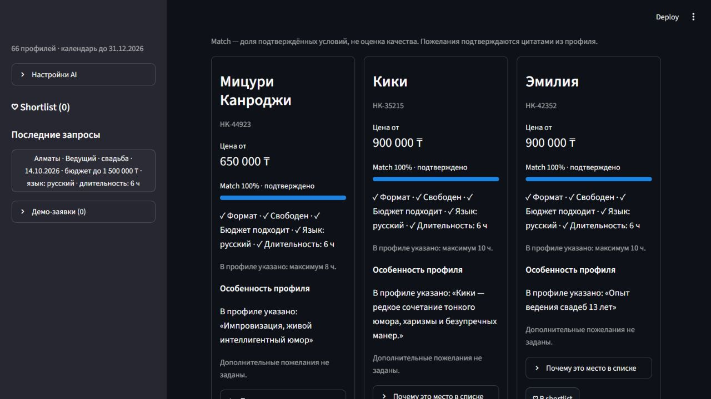
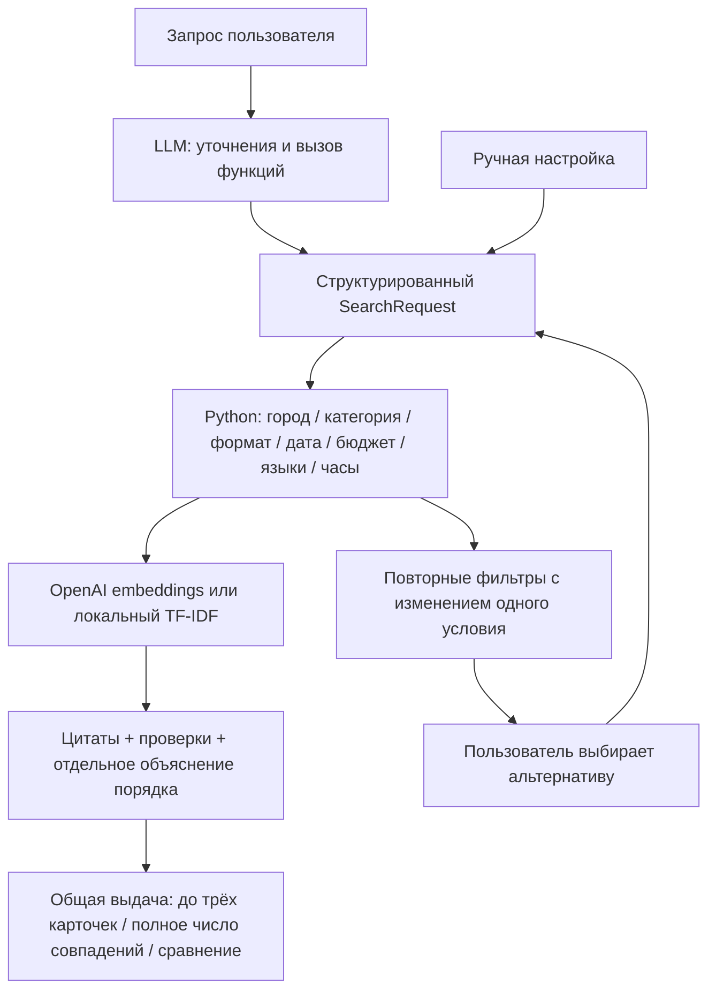

# Nurseitai

**AI-агент для поиска event-подрядчиков с проверяемыми объяснениями.**

Опишите мероприятие обычными словами. Агент уточнит условия, проверит каталог и покажет, чем отличаются подходящие исполнители. Прототип для HackAlem AI «Умный подбор подрядчиков».

`Запрос → извлечение условий → строгие фильтры → ранжирование → объяснения → TOP-3 и сравнение`



> Нужен ведущий на свадьбу в Алматы 3 октября 2026 года, бюджет до 1,5 млн тенге, русский язык, 6 часов. Без кринжовых конкурсов.

На эту дату по указанным обязательным условиям вариантов нет. Сервис повторно проверяет фильтры и предлагает **4 октября — два варианта**. Перенос применяется только кнопкой пользователя; пожелание подтверждается отдельно по описанию.

## Что получает пользователь

- **Один поиск:** чат — основной интерфейс, «Ручная настройка» корректирует те же условия и общую выдачу.
- **Русский календарь:** ввод даты `ДД.ММ.ГГГГ`, полные названия месяцев и неделя с понедельника; язык браузера не влияет на отображение. Несуществующая дата не запускает поиск со старым значением.
- **Проверяемый отбор:** условия и причины несовпадений рассчитываются по каталогу. Технические данные доступны, если администратор включил диагностику через `AI_DEBUG`.
- **Индивидуальные объяснения:** цитата из профиля, соответствие условиям, подтверждение пожеланий или честное отсутствие подтверждения.
- **До трёх рекомендаций:** показываем максимум три карточки и полное число подходящих, например «Подобрано 3 из 5». Можно сравнить рекомендации или сохранённый shortlist. Причина выдачи менее трёх вариантов видна в основном сообщении.
- **Происхождение данных:** цена и город, заполненные при подготовке датасета, отмечены рядом со значениями. Синтетические профили сохраняют отдельную отметку; цена обозначена как «от».
- **Полезный следующий шаг:** ближайшая более поздняя дата, минимальное увеличение бюджета, любой язык, меньшая длительность или настроенная альтернативная категория — с пересчитанным числом вариантов.
- **«Почему не этот подрядчик?»**: конкретные причины отказа, включая дату, цену, язык и длительность.
- **Shortlist и последние запросы:** живут в текущей сессии. Для связи доступен шаблон обращения: контактов в анонимном каталоге нет.

## Архитектура



LLM выбирает инструменты и формулирует ответ. Допуск кандидатов, счётчики и альтернативы рассчитывает Python. Каталог из **66 профилей** остаётся источником фактов.

### Match и порядок выдачи

**Match — доля подтверждённых условий, а не вероятность успеха или оценка качества.** У двух кандидатов без пожеланий может быть 100%: оба проходят все фильтры. Различия показываются цитатами, ценой, языками и ограничениями.

Порядок при наличии пожеланий: `80 × текстовая близость + 20 × доля оставшегося бюджета`. При отсутствии бюджета вторая часть равна нулю. Без пожеланий — цена, затем ID. Баллы порядка доступны только в диагностических данных при включённом администратором `AI_DEBUG` и не выдаются за Match.

Пожелания сравниваются с описанием отдельно от города, категории и формата. Для подтверждения используются словоформы и несколько дословных фрагментов. Отрицания обрабатываются консервативно. Синонимы могут повлиять на семантический порядок без подтверждения пожелания. «Квантовый реактор на Марсе» не получает ложного подтверждения за слово «свадьба».

Пожелания вроде «интеллигентный, с тонким юмором» и «с видеоотзывами» извлекаются из обычной речи. Видеоотзывы не меняют услугу на видеосъёмку. При вызове поиска используются сохранённые пожелания пользователя, а обязательные условия защищены от изменений моделью. Повтор одинаковых отклонённых аргументов останавливает цикл и возвращает уточнение.

### Семантический режим

Администратор включает семантическое ранжирование через `EMBEDDINGS_ENABLED = true` в `.streamlit/secrets.toml` или одноимённую переменную окружения. Используется OpenAI `text-embedding-3-small`; нужен ключ OpenAI, даже если чат работает через NVIDIA. Отправляются пожелания и описания только прошедших фильтры профилей. Векторы кешируются в памяти сессии по модели и тексту.

По умолчанию работает локальный TF-IDF со стеммингом русского языка. При сбое embeddings поиск продолжает работать локально с явным сообщением. Семантическая близость никогда не отменяет обязательные условия и сама по себе не считается доказательством пожелания.

## Запуск

Python 3.10+:

```bash
git clone https://github.com/BAITC-Hacks/hack-57ec179f-nurseitai.git
cd hack-57ec179f-nurseitai
python -m venv .venv
```

Активируйте окружение: Windows PowerShell — `.venv\Scripts\Activate.ps1`, macOS/Linux — `source .venv/bin/activate`.

```bash
python -m pip install -r requirements.txt
python -m streamlit run app.py
```

Откройте `http://localhost:8501`. Для чата скопируйте `.streamlit/secrets.toml.example` в `.streamlit/secrets.toml` и заполните ключ выбранного провайдера. [Подключение OpenAI / NVIDIA и инструменты агента](AGENT_SETUP.md).

Параметры AI задаёт администратор, переключателей в интерфейсе нет. `AI_PROVIDER` выбирает `openai` (по умолчанию) или `nvidia`; `EMBEDDINGS_ENABLED` и `AI_DEBUG` по умолчанию равны `false`. Можно использовать одноимённые переменные окружения; значения из `secrets.toml` имеют приоритет.

Без ключей работает ручная настройка с тем же поиском. Секреты исключены из Git. Чат передаёт сообщения и результаты функций выбранному API; embeddings подключаются отдельно и расходуют квоту.

## Проверка

```bash
python -m unittest discover -s tests -v
```

Локальные тесты проверяют фильтры, пожелания, ранжирование, альтернативы, протоколы обоих API и интерфейс. Регрессии диалога используют отдельный тестовый каталог: неизвестные услуги, фото+видео с AND, память условий, просмотр неподходящих профилей, пустые ответы и ошибки API. API подменяются: тесты не расходуют квоту и не доказывают качество живой модели.

### Потребность и память диалога

До сбора условий проверяется услуга. «Другое» означает неопределённую категорию. Фотосъёмка — «Фотограф», видеосъёмка — «Видеограф»; обе услуги у одного подрядчика требуют обеих категорий. Будки сопоставляются только с явно названной фотобудкой, фотозеркалом или видеобудкой. Если совмещающего специалиста нет, переход к двум отдельным требует выбора пользователя.

Потребность, услуги, условия, результаты и выбранный подрядчик хранятся отдельно. Исправление категории сохраняет условия. «Без разницы» снимает соответствующий фильтр, включая дату; без даты доступность не заявляется. Полный запрос запускает поиск без дополнительного разрешения. Модель не может подменить условия аргументами инструмента.

Выбор подрядчика и изменение условий обрабатываются вместе. Если выбранный профиль выходит за новый бюджет, агент сохраняет выбор и показывает разницу между начальной ценой и бюджетом; другого исполнителя автоматически не выбирает.

Короткие ответы («не важно», «мне всё без разницы», число в ответ на бюджет или часы) относятся к последним заданным вопросам. Уже известные город, услуга и остальные условия сохраняются. Для запроса «фотограф в декабре в Алмате на ближайшую свободную дату» декабрь хранится как период: поиск проверяет дни по порядку со всеми обязательными условиями. Ответ «не важно» на уточнение дня внутри месяца сохраняет месяц; выход за календарь каталога требует нового выбора.

В чат попадает текст, служебный JSON остаётся во внутренней истории. Пустой или технический ответ и сбой после поиска заменяются текстом из проверенных результатов. Разбор распространённых русских формулировок консервативный: нераспознанные значения уточняются или задаются вручную.

Сценарий для демонстрации: **Алматы · ведущий · свадьба · 14.10.2026 · 1 500 000 ₸ · русский · 6 часов**. Найдено пять вариантов, первые три — Мицури Канроджи, Кики, Эмилия. В карточках разные цитаты. На **03.10.2026** — пустая выдача с предложением **04.10.2026, два варианта**. Ответ «без разницы» на бюджет, язык или длительность отключает соответствующий фильтр.

## Структура и границы прототипа

| Файл | Назначение |
| --- | --- |
| `app.py`, `assistant_ui.py`, `results_ui.py` | Единый интерфейс и карточки |
| `assistant.py` | Цикл агента, аргументы и протоколы API |
| `dialogue.py` | Услуги, состояние и защита видимого ответа |
| `date_picker.py`, `date_picker_frontend/` | Русский календарь и проверка выбранной даты |
| `recommender.py`, `preferences.py` | Фильтры, ранжирование, цитаты, альтернативы |
| `semantic.py` | Embeddings и кеш |
| `product.py` | Сравнение, история, shortlist, демо-заявки |
| `data/contractors.csv` | Анонимизированный каталог |
| `data/related_categories.json` | Явно заданные замены категорий: ресторан ↔ банкетный зал |

Календарь ограничен 23.09–31.12.2026. Доступность означает отсутствие даты в списке занятости CSV, цена — указанную минимальную цену. Рекламные утверждения профиля не проверены. История и черновики не сохраняются в БД; настоящего бронирования, оплаты и отправки заявок нет. Свободный ответ LLM может ошибаться — карточки показывают вычисленные данные. Публичного развёртывания пока нет.
